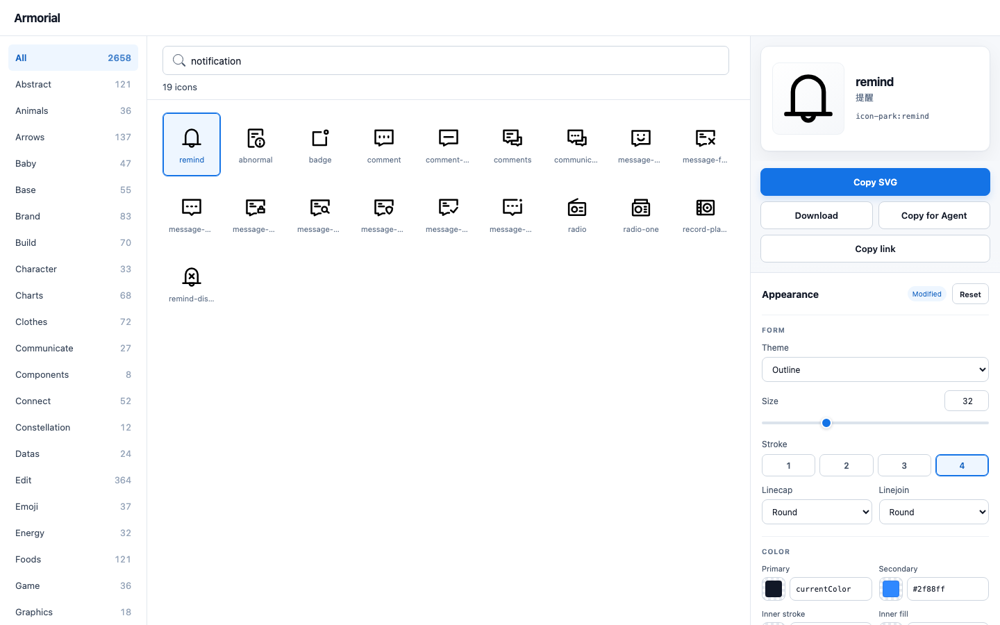

# Armorial

Choose consistent UI icons and use them in your product. Armorial searches
2,658 existing IconPark icons in English and Simplified Chinese, applies project
appearance defaults, and delivers SVG through a browser, CLI, MCP, or Figma.
It runs locally and preserves the original icon geometry.

**[Open the workbench](https://tetracoralla.github.io/armorial/)** ·
[Agent integration](https://tetracoralla.github.io/armorial/agent-selection.html) ·
[CLI guide](docs/CLI.md)



## Choose visually

Search or browse, select an icon, and adjust its theme, colors, size and stroke.
Copy SVG, download, or drag into a compatible destination. **Copy link** shares
the selected icon and appearance so another person can reopen it; the link
contains no project path or policy name. A changed asset is flagged for review.
**Copy for Agent** carries the exact selection back to a coding/design task.

Use an existing project icon system when it already fits. Armorial is useful
for a new interface, a consistent replacement set, visual comparison, or a
project that wants explicit, reproducible icon choices. It supplies IconPark
assets, not logos, illustrations or arbitrary SVG editing.

## Agent discovery and selection

An Agent can use Armorial while building a page or app without the user naming
it. The shipped [Skill](skills/icon-svg-select/SKILL.md) describes that task fit,
allows the caller to judge metaphors and candidates, and supports MCP or CLI.

```text
select_icons({ intents: ["search", "settings", "close"] })
```

This returns compact ordered choices, project style and unresolved candidates,
without generating SVG. The Agent can keep successful choices and refine or
choose the remaining ids. Use `resolve_icon` for one meaning plus SVG,
`search_icons` to explore, or `get_icon` / `get_icons` to render chosen ids.
`choose_icon` opens the visual workbench for a human decision.

A deterministic ambiguity does not prevent the Agent from choosing an icon
using the task context. The resulting asset still comes from the shared kernel.
The [product model](docs/PRODUCT_MODEL.md) explains the division of responsibility.

## Install from source

Node.js 22 or newer is required.

```sh
git clone https://github.com/tetracoralla/armorial.git
cd armorial
npm ci
npm run build
node dist/adapters/cli.js select search settings close
npm run start:ui
```

The local workbench opens at `http://127.0.0.1:4178`. After building, an MCP
client can launch `node /absolute/path/to/armorial/dist/adapters/mcp.js`, or
`node /absolute/path/to/armorial/dist/adapters/cli.js mcp`.
Agent Host is optional. For its packaged plugin, see
[plugin runtime](docs/CODEX_PLUGIN_RUNTIME.md).

Public distribution consists of this repository, source releases, the
GitHub Pages workbench, and a macOS arm64 plugin archive on
[GitHub Releases](https://github.com/tetracoralla/armorial/releases/latest).
The archive includes the Agent runtime and dependencies; Node 22 or newer is
required. See [archive setup](docs/CODEX_PLUGIN_RUNTIME.md#use-the-release-archive).
npm and official MCP Registry publication are not claimed.
`server.json` describes a prepared package route; it does not make
`npx armorial` an available public installation. The hosted
[source commit](https://tetracoralla.github.io/armorial/source-commit.txt)
identifies the deployed version; an unreleased local change may be newer.

## Put icons into a UI

```sh
# Select ids and style without SVG.
node dist/adapters/cli.js select search settings close

# Render one icon to stdout.
node dist/adapters/cli.js resolve search --format svg

# Create a sprite without returning SVG to the Agent.
node dist/adapters/cli.js batch search settings close --resolve-intents --output icons.svg
```

Run file commands from the consuming project's directory, using the absolute
CLI path if necessary. A sprite can be consumed with:

```html
<button aria-label="Search">
  <svg width="24" height="24" aria-hidden="true"><use href="icons.svg#armorial-search" /></svg>
</button>
```

For single-file HTML, the CLI can create a new candidate containing an inline
sprite without modifying the source. Existing outputs are preserved by default.
See [CLI usage and recovery](docs/CLI.md) for file modes, partial results,
appearance options and interrupted writes.

## Project appearance

Start from [icon-policy.example.json](icon-policy.example.json). A policy holds
default appearance, named surface overrides, and semantic choices such as
`"settings": "icon-park:setting-two"`. Explicit call overrides apply last and
report `overridden` when they change the effective policy.

Policy lookup is `--policy`, `ICON_SVG_SELECT_POLICY`, `./icon-policy.json`, then
built-in defaults. Context is an actual configured key, not a prose description.
Stroke weight uses IconPark's integer **1–4** scale and scales with icon size.
Version 1 policies used a different unit; see [CHANGELOG.md](CHANGELOG.md).

## Figma

Run `npm run build:figma`, then import `figma-plugin/manifest.json` through
Figma Desktop's development-plugin menu. The offline plugin shares the same
catalog and workbench. Click or drop an icon as a Component or editable frame;
choose outlining and layer structure when needed. Appearance and output
settings persist in Figma. This adapter is built separately from the npm package.

## Development and licenses

[CONTRIBUTING.md](CONTRIBUTING.md) maps development commands;
[verification map](docs/REVIEW_CONTRACT.md) points to relevant behavioral checks.
The current API and workflow examples are implementation choices, not restrictions
on future product design.

Armorial and IconPark assets use Apache-2.0. See [LICENSE](LICENSE),
[NOTICE](NOTICE), and [THIRD_PARTY_NOTICES.md](THIRD_PARTY_NOTICES.md).
